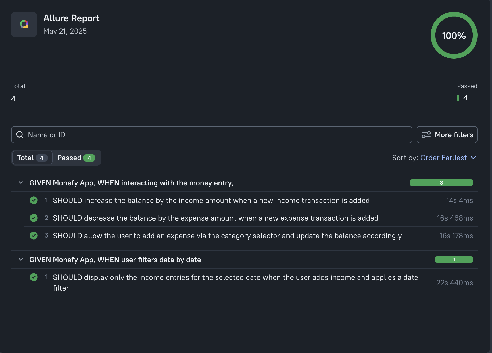

# Monefy Android App Test Automation Suite

## Overview
This project implements an automated test suite for validating core functionalities of the Monefy Android application. Built with WebdriverIO, Appium, and TypeScript, it provides a robust framework for testing financial transactions and data filtering capabilities. The solution supports both local execution and Dockerized environments for consistent testing workflows.

---

## Additional Documentation:
- [Exploratory Testing Report](/docs/exploratoryTestingReport.md)
- [Test Architecture And Implementation Strategy](/docs/testArchitectureAndImplementationStrategy.md)


## 🛠 Technical Stack
- **WebdriverIO**: Test runner for browser and mobile automation
- **Appium**: Cross-platform automation for native/hybrid apps
- **TypeScript**: Type-safe code implementation
- **Mocha**: Test framework
- **Allure**: Test reporting with screenshots and step tracking
- **Docker**: Containerized Android emulation environment

---

## ⚙️ Prerequisites
- Node.js v18+
- Java JDK 11+ (for Appium server)
- Android SDK/emulator (for local execution)
- Docker Engine (optional for containerized setup)

---

## 🚀 Quick Start Guide

### 1. Repository Setup
```bash
git clone https://github.com/0xIslamTaha/monefy-framework-ts-appium.git
cd monefy-test-automation
npm install
```

### 2. Environment Configuration
Create `.env` file in project root:
```env
APPIUM_PORT=4725
PLATFORM_NAME=Android
PLATFORM_VERSION=16
DEVICE_NAME='Medium Phone API 36.0'
APP_NAME='monefy.apk'
APP_ID='com.monefy.app.lite'
```

### 3. Test Execution
**Local Environment:**
1. Start Android emulator/device
```bash
chmod +x ./scripts/start-android-emulator.sh
./scripts/start-android-emulator.sh
```
2. Run test suite:
```bash
npm run wdio
```

**Dockerized Environment: [Linux Only]**
```bash
# Start Android container. Appium runnes in port 4723
chmod +x ./scripts/start-docke-container.sh
./sctipts/start-docke-container.sh

# Execute tests (in separate terminal)
npm run wdio
```

---

## 🧪 Test Coverage

### Core Functionality Verification
| Test Suite              | Key Validations                          |
|-------------------------|------------------------------------------|
| `transactions.spec.ts`  | - Balance updates on income/expense<br>- Category-based transaction handling |
| `filters.spec.ts`       | - Date filtering accuracy<br>- Data isolation in filtered views |

### Execution Control
- Run specific test files: `npx wdio wdio.conf.ts --spec ./test/specs/[filename]`
- Mocha's `.only` modifier for focused testing

---

## 📦 Docker Implementation
The `start-docke-container.sh` initializes:
- Android 13 emulator (Samsung Galaxy S10 profile)
- Appium server on port 4723
- Web VNC access on port 6080

**Key Configuration:**
```bash
docker run -d \
  -p 6080:6080 \
  -p 4723:4723 \
  -e EMULATOR_DEVICE="Samsung Galaxy S10" \
  -e WEB_VNC=true \
  -e APPIUM=true \
  --device /dev/kvm \
  --name android-container \
  budtmo/docker-android:emulator_13.0
```

---

## 📊 Reporting
Allure reports are generated in `./allure-results` with:
- Step-by-step test execution
- Error context for failed assertions

Generate HTML report post-execution:
```bash
npm run report
```

Clean the generated report:
```bash
npm run clean
```

### Sample Test Report


---

## 🚨 Troubleshooting
| Issue                          | Resolution Steps                         |
|--------------------------------|------------------------------------------|
| APK not found                  | Verify `.env` APP_NAME matches APK Name and the app in existing under ./app dir  |
| Docker KVM errors              | Validate virtualization support in your OS. It should be working fine with Linux OS |

---

Thank you for reviewing this test automation implementation. I welcome any feedback or discussion about architectural decisions and potential improvements to the testing strategy.
